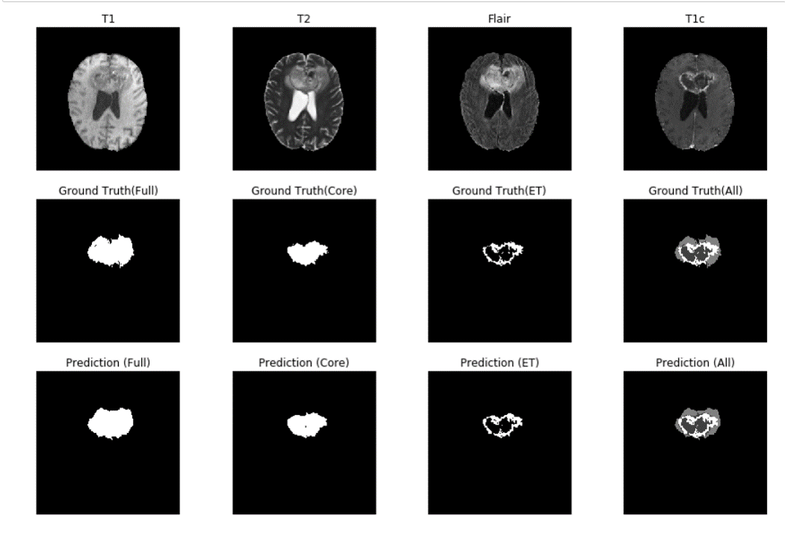
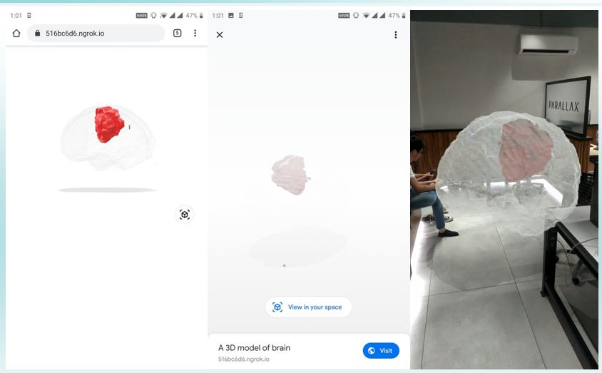

# Reports3D
##### A deep learning CNN solution which segments brain tumours from MRI scans and reconstructs with accurate location, size and orientation a 3D model of the tumour embedded in the patient brain, available for viewing in an Augmented Reality enviroment.

There exists a vast semantic gap between doctors and patients when it comes to medical imaging. This application is aimed to reduce this communication barrier by making extant tumours easier to visualise in 3 dimensions.

#### Architectue of model: U-NET Model

#### Image segmentation results:

Comparison of ground truth with predicted images
 
#### Performance:
| Mean Dice Similarity Coefficient | Median Dice Similarity Coefficient |
| ------------- | ------------- |
| 0.87  | 0.90  |

#### Final output:

### See it in action [here](https://drive.google.com/file/d/1ipvxDdG15vjd46c9VfBblj-jWBFBHM1U/view?usp=sharing)
